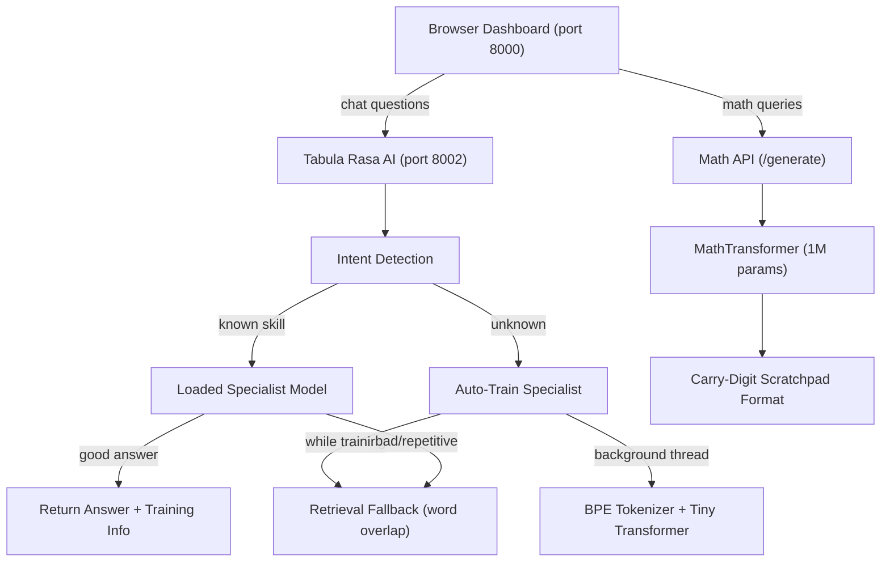

# Tabula Rasa

[](LICENSE)
[](https://www.python.org/downloads/)
[](https://github.com/Matrix-Research-Ai/tabula-rasa/actions/workflows/test.yml)

A transformer trained from a **blank slate** — no pretraining, no transfer learning,
just gradient descent from random initialization. Proves that a 1M-parameter
model can learn arithmetic from scratch, and **auto-trains new specialists** for
unknown questions on-the-fly.

---

## Quickstart (60 seconds)

**Prerequisites:** Python 3.9+, PyTorch 2.0+.

```bash
# 1. Clone
git clone https://github.com/Matrix-Research-Ai/tabula-rasa.git
cd tabula-rasa

# 2. Install
pip install torch numpy tqdm

# 3. Train a 1-digit addition specialist (smoke test, ~30 seconds CPU)
python3 scripts/train_specialist.py add --quick

# 4. Start the AI (port 8002) + Dashboard (port 8000)
python3 scripts/api_server.py        # Dashboard on port 8000
python3 -c "from egefalos.tabula_rasa import main; main()"   # AI on port 8002

# 5. Open http://localhost:8000 in your browser
```

---

## Features

### 🧠 Auto-Training Conversational Specialists
Ask anything — if no specialist exists, the system **auto-trains one** in the background:

| Question | Intent | Auto-trains |
|----------|--------|-------------|
| "hello" | greeting | Greeting specialist |
| "What can you do?" | capability_question | Capability specialist |
| "Where are you from?" | explanation_question | Explanation specialist |
| "What is AI?" | definition_question | Definition specialist |
| "Tell me a joke" | conversation | Conversation specialist |

Training progress shown live in the UI (`Training greeting: 50/500 (10%) loss=3.21 12st/s 36s CPU4`).

### 🔄 Continual Improvement
Each time you ask, the specialist **retrains with +100 extra steps**. If answers are too short or repetitive, the model **auto-scales** (d_model increases by 32, steps by 500 per level).

| Level | d_model | layers | steps | Params |
|-------|---------|--------|-------|--------|
| 0 | 128 | 4 | 1000 | 560K |
| 1 | 160 | 4 | 1500 | 880K |
| 2 | 192 | 4 | 2000 | 1.3M |
| 3 | 224 | 5 | 2500 | 1.8M |
| ... | up to 384 | 6 | up to 4000 | ~3.8M |

### 📋 Multi-Session Chat
Sidebar with multiple conversation sessions, saved to browser localStorage.
Each session has auto-naming, message counts, and export (📤) to copy session
history as JSON.

### 📊 Training Info Per Answer
Every AI response shows its training status: `Lv2 d=160 st=1500 142K retrieval`.

### 🔍 Debug Logging
All intent detection, model lookups, generation output, and training events
logged to `debug_tabula.log`.

### 🧮 Math Specialists
Train operation-specific specialists (add, sub, mul, div) with curriculum learning,
EWC continual learning, and scratchpad format.

---

## Usage

### Start the System

```bash
# Option A: Batch file (Windows)
start_tabula_rasa.bat

# Option B: Launch manually
python3 scripts/api_server.py                    # Dashboard on port 8000
python3 -c "from egefalos.tabula_rasa import main; main()"  # AI on port 8002
```

### Train Math Specialists

```bash
# Full training (30K steps, ~9 hours CPU)
python3 scripts/train_specialist.py add

# Quick smoke test
python3 scripts/train_specialist.py add --quick

# With custom parameters
python3 scripts/train_specialist.py add --steps 5000 --batch 128

# Resume from checkpoint
python3 scripts/train_specialist.py add --resume

# Train all operations sequentially
python3 scripts/train_specialist.py all
```

### Auto-Train (Weakest-First)

```bash
python3 scripts/auto_train.py                    # Train until all ops reach 50%
python3 scripts/auto_train.py --target 70        # Train until all ops reach 70%
python3 scripts/auto_train.py --ops add sub      # Only addition and subtraction
```

### API

```bash
# Query the math model
curl -X POST http://localhost:8000/generate \
  -H "Content-Type: application/json" \
  -d '{"prompt":"12+34="}'

# Query the AI (conversational)
curl -X POST http://localhost:8002/ask \
  -H "Content-Type: application/json" \
  -d '{"question":"hello"}'

# Check training progress
curl http://localhost:8002/training-progress
```

---

## Architecture



---

## Project Structure

```
tabula-rasa/
  train.py                   # Main math training entry point
  serve.py                   # Legacy server
  start_tabula_rasa.bat      # One-click launcher (Windows)

  scripts/
    train_specialist.py       # Train math specialists
    train_router.py           # Train neural semantic router
    api_server.py             # Dashboard + math API (port 8000)
    auto_train.py             # Autonomous weakest-first training
    train_sub_mul.sh          # GPU training script

  src/tabula_rasa/
    model.py                  # Transformer from scratch
    tokenizer.py              # Math carry-digit tokenizer
    bpe_tokenizer.py          # BPE tokenizer for chat
    chat_dataset.py           # Chat QA dataset
    config.py                 # Config class

  egefalos/
    tabula_rasa.py            # AI server (port 8002) + auto-training
    online_ewc.py             # Elastic Weight Consolidation
    router_model.py           # Neural intent router (541K)
    hippocampus.py            # 3-tier memory (SQLite)
    sleep_cycle.py            # Consolidation daemon
    socratic_trainer.py       # Self-improvement training

  Dashboard/
    core/dashboard.html       # Main dashboard
    views/interactive_chat.html  # Multi-session chat UI

  tests/                     # pytest test suite (88+ tests)
```

---

## Performance

| Operation | 1-digit | 2-digit | 3-digit | 4-digit |
|-----------|---------|---------|---------|---------|
| Addition | 100% | 58-76% | ~50% | ~51% |
| Subtraction | ~50% | ~20% | ~10% | ~5% |
| Multiplication | ~30% | ~10% | ~5% | ~3% |

---

## Key Findings

- **Digit reversal is critical** — without it, the Causal-Carry Mismatch prevents
  multi-digit carry propagation.
- **Loss masking provides 2x convergence speed** — ~70% of gradient was wasted
  on prompt tokens before this fix.
- **ReLU is competitive with SwiGLU** at 1M parameters.
- **Auto-training from scratch** works for conversational intents but quality
  improves with model size — retrieval fallback ensures correct answers while
  neural model continues training.

---

## Debugging

```bash
# View debug log (intent detection, training, generation)
cat debug_tabula.log

# View auto-training errors
cat auto_train_errors.log

# Check training progress
curl http://localhost:8002/training-progress

# Health check
curl http://localhost:8002/health
curl http://localhost:8000/health
```

---

## Community

- [GitHub Issues](https://github.com/Matrix-Research-Ai/tabula-rasa/issues) — report bugs, request features
- [CONTRIBUTING.md](CONTRIBUTING.md) — setup guide, code standards, PR process

## License

MIT
