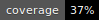
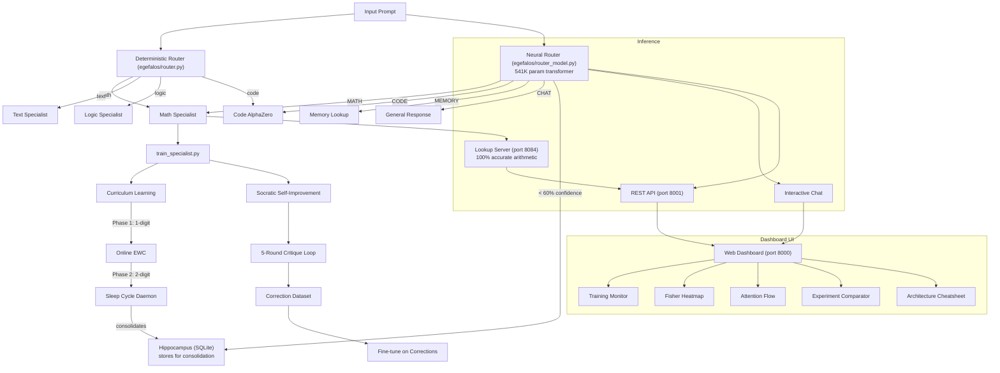
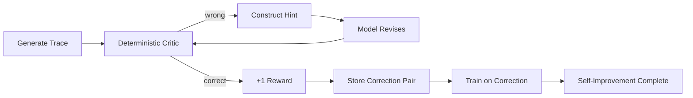
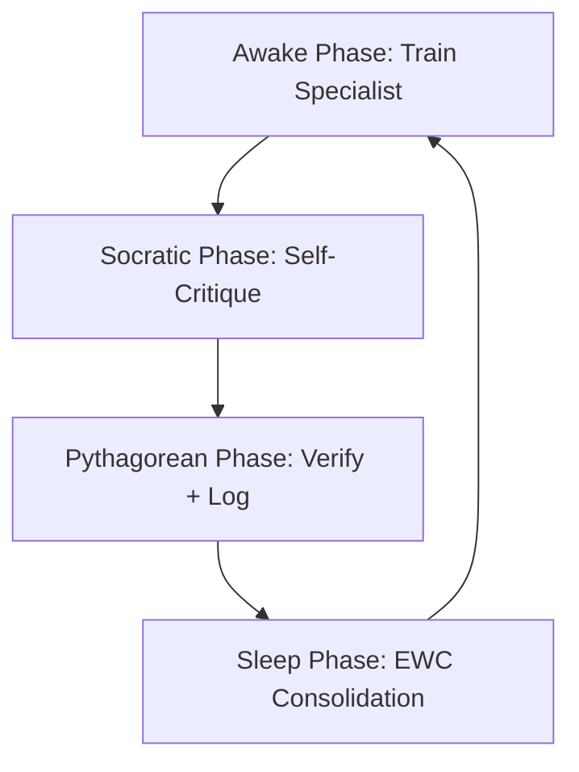

# Tabula Rasa

[](LICENSE)
[](https://www.python.org/downloads/)
[](https://github.com/tabula-rasa-ai/tabula-rasa/actions/workflows/test.yml)
[](https://github.com/tabula-rasa-ai/tabula-rasa)
[](https://github.com/tabula-rasa-ai/tabula-rasa/actions/workflows/test.yml)

A transformer trained from a **blank slate** — no pretraining, no transfer learning,
just gradient descent from random initialization. Currently proving that a 1M-parameter
model can learn arithmetic through a novel fused carry-digit scratchpad format.

---

## Quickstart (60 seconds)

**Prerequisites:** Python 3.9+, PyTorch 2.0+, Git.

```bash
# 1. Clone
git clone https://github.com/tabula-rasa-ai/tabula-rasa.git
cd tabula-rasa

# 2. Install
pip install torch numpy tqdm

# 3. Train a 1-digit addition specialist (smoke test, ~30 seconds CPU)
python3 train_specialist.py add --quick

# Expected output (last line):
#   Done! ~30s | Best: 80-100% | Steps: 200

# 4. Test it
python3 -c "
from pathlib import Path
import torch
from tabula_rasa.config import Config
from tabula_rasa.tokenizer import MathTokenizer
from tabula_rasa.model import MathTransformer

tok = MathTokenizer.load('specialists/math/add/tokenizer.json')
cfg = Config(); cfg.vocab_size = tok.vocab_size
model = MathTransformer(cfg)
state = torch.load('specialists/math/add/best.pt', map_location='cpu', weights_only=True)
model.load_state_dict(state['model_state_dict'])
model.eval()

for expr in ['2+2=', '5+7=', '12+34=', '99+1=']:
    out = model.generate(tok, expr, max_new_tokens=10, temperature=0.0)
    print(f'{expr} -> {out.split(\"=\")[-1].replace(\"<EOS>\",\"\")}')
"
```

**What just happened:**
1. A transformer initialized with random weights
2. Trained on 2,000 addition problems using fused carry-digit scratchpad format
3. Learned to add 1-digit numbers with carries (e.g. 5+7=12)
4. Saved a checkpoint to `specialists/math/add/best.pt`

---

## How It Works

### The Core Innovation: Carry-Digit Scratchpad

Standard transformers struggle with arithmetic because they must learn both the
algorithm and the digit representation simultaneously. Tabula Rasa's **fused
carry-digit tokenizer** decomposes addition into per-column (carry, digit) pairs:

```
Problem:   12 + 34 = ?
Scratchpad: 04 06     (carry=0, digit=4 | carry=0, digit=6)
                    -> LSD-first: digits = [6, 4] -> reversed = "46"
```

Each column is a single token in a 44-token vocabulary. This reduces the problem
from "learn the addition algorithm" to "learn carry propagation across columns."

### Architecture

| Component | Value |
|-----------|-------|
| Parameters | ~1,060,992 |
| Layers | 4 (decoder-only transformer) |
| Hidden dim | 128 |
| Attention heads | 4 |
| Feed-forward | 512 |
| Position encoding | RoPE |
| Activation | ReLU / SwiGLU |
| Vocabulary | 44 tokens (digits, ops, carry pairs) |
| Context window | 32 tokens |

### Continual Learning (Phase 2)

Online Elastic Weight Consolidation (EWC) prevents catastrophic forgetting when
the model trains on sequential tasks. The hippocampus stores high-surprise
experiences for replay during sleep cycles.

In addition to EWC, three complementary continual learning methods are available:

| Method | Mechanism | When to Use | File |
|--------|-----------|-------------|------|
| **OGD** | Gradient projection orthogonal to past tasks | Overlapping parameter usage | `egefalos/ogd.py` |
| **LwF** | Knowledge distillation from frozen teacher | Scarce labels, abundant unlabeled data | `egefalos/lwf_gem.py` |
| **GEM** | Episodic memory + gradient projection | Small exemplars per task available | `egefalos/lwf_gem.py` |

### Architecture Overview



### Socratic Critique Loop



### Cognitive Clock Cycle



### Phase 3 (In Development)

- **Socratic Engine:** Self-critique loop — model generates a trace, a
  deterministic parser checks it, and incorrect traces generate revision hints.
- **MCTS / AlphaZero:** Monte Carlo Tree Search for self-play improvement.
- **MathGymEnv:** Gymnasium-style environment for arithmetic reinforcement learning.

---

## Usage

### Training

```bash
# Full training (30K steps, ~9 hours CPU)
python3 train_specialist.py add

# With custom parameters
python3 train_specialist.py add --steps 5000 --batch 128 --lr 0.0005

# Resume from checkpoint
python3 train_specialist.py add --resume

# Train all 4 operations sequentially
python3 train_specialist.py all

# Enable Socratic self-improvement (post-training refinement)
python3 train_specialist.py add --socratic --socratic-steps 1000
```

### Ablation Flags

```bash
python3 train_specialist.py add --no-reversed     # Disable digit reversal
python3 train_specialist.py add --no-loss-mask    # Disable prompt masking
python3 train_specialist.py add --deep             # d=64, L=8 (531K params)
python3 train_specialist.py add --ewc --ewc-lambda 500    # EWC continual learning
```

### API Server

```bash
# Start the dashboard + API (two servers)
python3 api_server.py      # Dashboard on port 8000
# Open http://localhost:8000 in your browser

# Query the model via API
curl -X POST http://localhost:8000/generate \
  -H "Content-Type: application/json" \
  -d '{"prompt":"12+34="}'
```

### Evaluation

```bash
# Per-digit breakdown
python3 -c "
import sys; sys.path.insert(0, 'src')
from train_specialist import evaluate_per_digit
from tabula_rasa.generate import load_model
from tabula_rasa.config import Config
model, tok = load_model('specialists/math/add/best.pt')
cfg = Config(); cfg.vocab_size = tok.vocab_size
per_digit = evaluate_per_digit(model, tok, cfg, 'add', per_digit_samples=30)
for d, acc in per_digit.items():
    print(f'  {d}-digit: {acc:.1f}%')
"
```

---

## Project Structure

```
tabula-rasa/
  train_specialist.py      # Main training script
  api_server.py            # API + dashboard server
  app.py                   # Hugging Face Spaces demo
  src/tabula_rasa/
    model.py               # Transformer from scratch
    tokenizer.py           # Fused carry-digit tokenizer
    math_parser.py         # Deterministic scratchpad verifier
    config.py              # Config class
  egefalos/                # Phase 2/3 cognitive systems
    online_ewc.py          # Elastic Weight Consolidation
    hippocampus.py         # 3-tier memory (SQLite)
    sleep_cycle.py         # Consolidation daemon
    socratic_critique.py   # 5-round self-correction loop
    socratic_trainer.py    # Self-improvement via critique training
    math_gym_env.py        # Gymnasium env for RL
    mcts.py                # Monte Carlo Tree Search
    micro_orchestrator.py  # Router with success memory
    router.py              # Deterministic prompt router
  Dashboard/               # Web dashboard (25+ views)
  tests/                   # pytest test suite (88+ tests)
  hf_space/                # Hugging Face Spaces config
```

---

## Performance

| Operation | 1-digit | 2-digit | 3-digit | 4-digit |
|-----------|---------|---------|---------|---------|
| Addition (4L, ReLU) | 100% | 58-76% | ~50% | ~51% |
| Subtraction | ~50% | ~20% | ~10% | ~5% |
| Multiplication | ~30% | ~10% | ~5% | ~3% |

See [GPU_BENCHMARKS.md](GPU_BENCHMARKS.md) for throughput by hardware.

---

## Key Findings

- **Digit reversal is critical** — without it, the Causal-Carry Mismatch prevents
  multi-digit carry propagation.
- **Loss masking provides 2x convergence speed** — ~70% of gradient was wasted
  on prompt tokens before this fix.
- **ReLU is competitive with SwiGLU** at 1M parameters.
- **Causal mask bug fixed** (commit 47c4b2b) — model was training with
  bidirectional attention. A regression test now catches this.

---

## Community

- [Telegram](https://t.me/TabulaRasaAi) — discussion, help, development chat
- [GitHub Issues](https://github.com/tabula-rasa-ai/tabula-rasa/issues) — report bugs, request features
- [CONTRIBUTING.md](CONTRIBUTING.md) — setup guide, code standards, PR process
- [GOOD_FIRST_ISSUES.md](GOOD_FIRST_ISSUES.md) — beginner-friendly tasks

## Citation

```bibtex
@software{tabula_rasa_2024,
  author = {Tabula Rasa AI},
  title = {Tabula Rasa: Learning from Scratch, One Specialist at a Time},
  year = {2024},
  url = {https://github.com/tabula-rasa-ai/tabula-rasa}
}
```

## License

MIT
